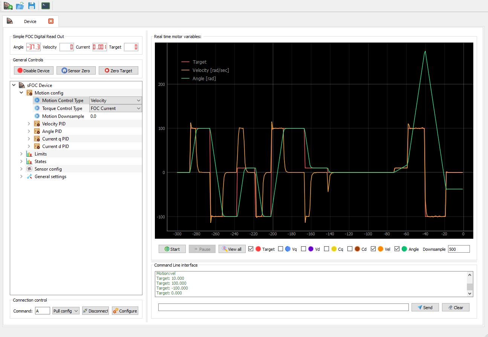
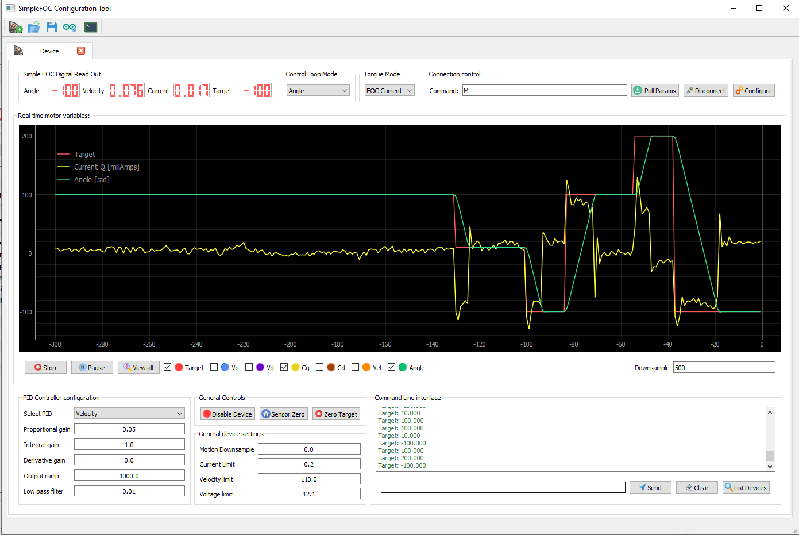
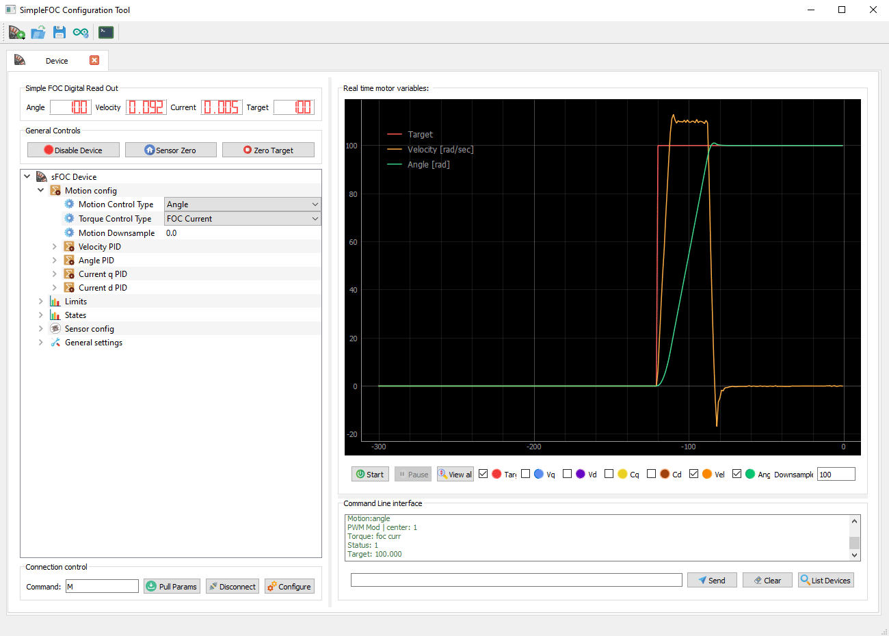
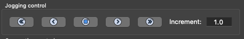
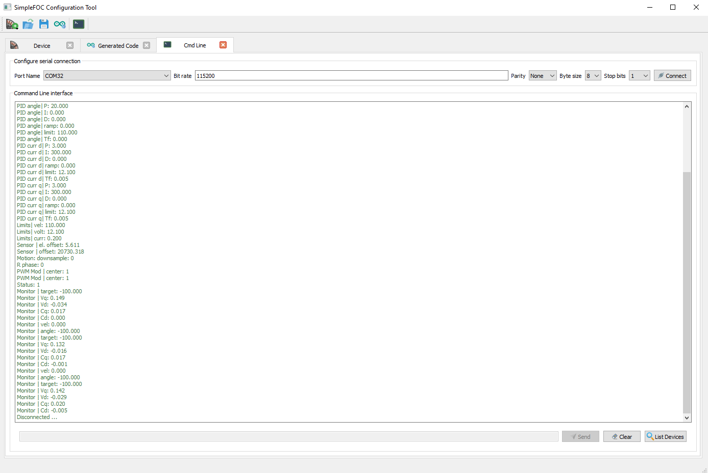

## *Simple**FOC**Studio*

Graphical user interface for the [*Simple**FOC**library*](https://github.com/simplefoc). This application allows to tune and configure any BLDC/Stepper *Simple**FOC**library* controlled device, using serial port communications and the [Commander](https://docs.simplefoc.com/commander_interface) interface.
#### The main features are:

- Plug and play with the *Simple**FOC**library* version 2.1
- Real-time tuning and configuration of the motors
- Real-time plotting and monitoring of motor variables
- Code generation for easier integration of the tuned parameters in your code
- Built on PyQt5 and a standardized `SimpleFOCConnector` interface that can be used as a gateway form python to the *Simple**FOC**library* device.

<p align="center">
  
</p>

### Installation
Don't worry, *Simple**FOC**Studio* is easy to install even if you have never used the terminal before! 😃
There are just couple of steps to take:
1. Install Python if you don't have it installed yet
    - We suggest to use Anaconda. [Here is how to install it.](https://docs.anaconda.com/anaconda/install/)
    - Once you have your Anaconda running open your terminal (on windows anaconda prompt) and run:
    ```sh
    conda create -n simplefoc python=3.9.0
    ```
    - Once this is done you will never have to run that command again, from now on you will just need:
    ```sh
    conda activate simplefoc
    ```
2. Clone this repository or download the zip file
3. Enter the folder containing the repository using the terminal
    -  the command will be something like this:
    ```sh
    cd  some_path_on_disk/SimpleFOCStudio
    ```
4. Final step of the installation is installing all the necessary libraries for the *Simple**FOC**Studio* :
    ```sh
    pip install -r "requirements.txt"
    ```

Once you have done all the steps above you do not need to repeat them any more. All you need to do the next time is open your terminal in the *Simple**FOC**Studio* directory and run the command:
```sh
python simpleFOCStudio.py
```
Or if using Anaconda:
```sh   
conda activate simplefoc
python simpleFOCStudio.py
```


### Usage
*Simple**FOC**Studio* has several useful features:
- A simple approach to tuning your motor setup
  - Form view for fast motion control PID/LPF tuning
  - TreeView for more in depth tunning and experimenting
- Code generation for transferring the found parameters into your arduino code
- Serial terminal integrated with various commander features
#### Motion control tunning windows


Once you have your application running add a device by clicking the   motor button in the toolbar. You can choose either the  TreeView or the FormView.
- To connect to your device first configure the serial port by clicking on Configure button
- Add your com port info and click OK
- Then add the device command ID that you've added to the commander usually its `M`
   - Command `M` , Arduino code : `command.add('M',doMotor,"my motor")`
   - Command `A` , Arduino code : `command.add('A',doMotor,"my motor")`
- Then click to the Connect button and you should be ready to go!

<p align="center">
  
  
</p>

#### Code generation

*Simple**FOC**Studio* helps you to easier transfer your carefully tuned parameters to the Arduino code. Once you are happy with the performance of your system you can automatically generate the arduino code of the parameters you have tuned. To generate the code :
- Click on the  Arudino button in the toolbar.
- Choose which sets of parameters you wish to generate the code for and click OK
- In the new tab you will have a code of your tuned parameters.

The generated code you can just copy/paste in your <code>setup()</code> function, just before calling the <code>motor.init()</code>

<p align="center">
  
</p>

#### Custom Commands

You can create your own custom commands if you [extend the Commnader interface](https://docs.simplefoc.com/commander_interface) in your sketch. This can be used for example to do things like change register settings for SPI devicesor any oyher functionality. Each custom command has a name and a value as you can see at the below image.

<p align="center">
  
</p>
Once you have added each custom command in order to execute it you just need to select it and once selected press the space key (⎵) or right arrow key (→).

#### Jogging panel
<p align="center">
  
</p>
This panel is used to actuate with yor motor without having to write comands, is like using a joystick but pressing buttons. Each buton performas an action:

- Fast Reverse button: reduces the current target by 2 times the specified increment.
- Reverse button: reduces the current target by the specified increment.
- Fordward button: Increase the current target by the specified increment.
- Fast Fordward button: Increase the current target by 2 times the specified increment.
- Stop button: in angle control mode, sets the current angle as target angle and in velocity control sets the target to zero.


#### Integrated serial terminal

*Simple**FOC**Studio* also has integrated serial terminal for easier debugging and monitoring.

<p align="center">
  
</p>

### Arduino code

Basically there are two things you need to do:
1. Use the commander interface and add the motor to the commander
2. Use the monitoring and add the `motor.monitor()` in the loop

Here is a mockup of the code:

```cpp
#include <SimpleFOC.h>

....

// include commander interface
Commander command = Commander(Serial);
void doMotor(char* cmd) { command.motor(&motor, cmd); }

void setup(){
  ....
  // add the motor to the commander interface
  // The letter (here 'M') you will provide to the SimpleFOCStudio
  command.add('M',doMotor,'motor');
  // tell the motor to use the monitoring
  motor.useMonitoring(Serial);
  motor.monitor_downsample = 0; // disable monitor at first - optional
  ...

}
void loop(){
  ....

  ....
  // real-time monitoring calls
  motor.monitor();
  // real-time commander calls
  command.run();
}
```
